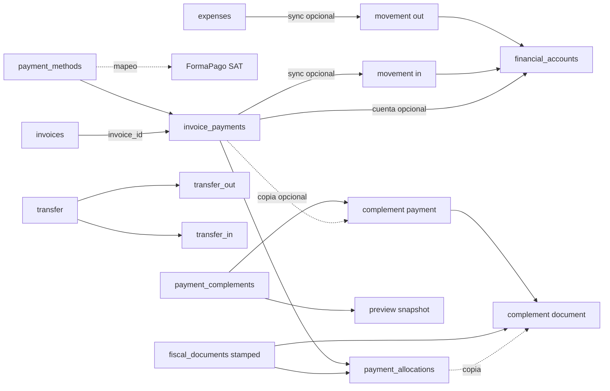
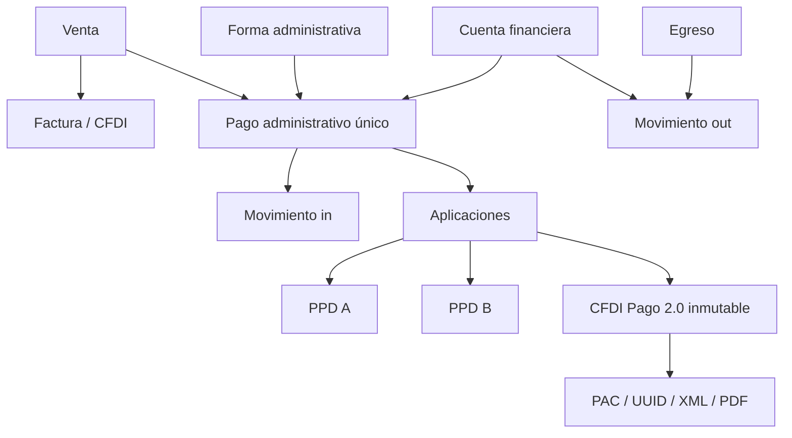

# Auditoría técnica: fiscal, cuentas, pagos y complementos

**Corte:** 2026-08-26. **Proyecto:** iKontrol 2.0 / CodeIgniter 4.6.1. **Naturaleza:** auditoría de solo lectura.

## 0. Alcance, método y certeza

Se inspeccionaron rutas, controladores, modelos, servicios, migraciones, el esquema RISE base (`install1/database.sql`), vistas/JavaScript, configuración PAC, comandos, pruebas y navegación. `php spark migrate:status` confirmó que las migraciones C2.5 de cuentas, aplicaciones y complementos fueron aplicadas el 2026-08-25 en la base configurada `ikontrol20_dold_preview` (prefijo físico `ikontrol_`).

El árbol ya estaba sucio antes de la auditoría. Los módulos `Financial_accounts` y `Payment_complements`, migraciones, modelos, servicios, vistas y tests C2.5 están sin seguimiento Git. Se auditan como estado actual aplicado; su falta de versionado es un riesgo. El JAM no pudo utilizarse: `PEGAR_AQUI_URL_DEL_JAM` no es una URL.

- **Confirmado por código:** evidencia directa.
- **Inferencia:** conclusión que requiere prueba funcional/datos para confirmarse.
- **No comprobable:** evidencia insuficiente.

## 1. Resumen ejecutivo

1. **Confirmado por código:** “Forma de pago administrativa” es `payment_methods`, catálogo RISE de medios/canales; no es cuenta financiera.
2. `fiscal_payment_method_mappings` mapea opcionalmente el medio administrativo a `sat_payment_forms.code`; forma administrativa, FormaPago SAT y cuenta son entidades separadas.
3. Existe `financial_accounts` y un ledger `financial_account_movements`; el saldo se deriva, no se almacena.
4. `Invoice_payments::save_payment()` puede crear movimiento `in`; `Expenses::save()` puede crear movimiento `out`.
5. La cuenta es opcional: pagos/gastos pueden existir sin afectar una cuenta.
6. Las tablas C2.5 no declaran foreign keys, unique de idempotencia ni checks; la integridad depende de servicios.
7. Transferencias crean dos movimientos (`transfer_out`/`transfer_in`) bajo el mismo ID de cabecera y transacción.
8. `invoice_payments.invoice_id` obliga a una factura legacy, pero `payment_allocations` permite aplicar el mismo pago a múltiples CFDI: hay dos asignaciones simultáneas.
9. El saldo legacy usa `invoice_payments`; el fiscal usa `payment_allocations`. Pueden divergir.
10. PPD/PUE vive en `fiscal_drafts.payment_method_code` y `fiscal_documents.payment_method_code`, no en `invoices`.
11. El complemento puede referenciar un pago por `source_invoice_payment_id`, pero copia fecha/monto y recaptura FormaPago SAT; también admite captura manual.
12. Al copiar aplicaciones, `PaymentComplementDraftService::addPayment()` silencia excepciones con `catch (Throwable) {}`.
13. `NumParcialidad` siempre es 1 e `ImpSaldoAnt` el total original: segundas parcialidades quedan mal.
14. Hay dos constructores XML inconsistentes; el usado por el endpoint omite emisor, receptor, saldos e impuestos calculados.
15. No existe ruta/controlador de timbrado de complemento: el flujo termina en preview, sin PAC, UUID, XML timbrado o PDF.
16. Los candidatos no se filtran por PPD ni saldo pendiente.
17. Se mezclan `double`, DECIMAL(18,6), float, BCMath y JS a dos decimales.
18. Fiscal ya agrupa Borradores/Facturas/Plantillas; Complementos queda como raíz sólo admin.
19. Los tests C2.5 son búsquedas estáticas con `str_contains`, no pruebas de DB/XML/integración.
20. El riesgo dominante es copiar el mismo hecho económico en pago, aplicación y tablas del complemento con copias editables.

## 2. Conceptos reales

| Concepto | Implementación actual | No confundir con |
|---|---|---|
| Forma de pago SAT | `sat_payment_forms.code`; `payment_form_code`/`FormaDePagoP` | una cuenta BBVA concreta |
| Método SAT | `sat_payment_methods.code` PUE/PPD; campos fiscales `payment_method_code` | `payment_methods` administrativo |
| Forma administrativa | `payment_methods`; `invoice_payments.payment_method_id` | cuenta o MetodoPago SAT |
| Cuenta financiera | `financial_accounts` | SAT 03 Transferencia |
| Pago administrativo | `invoice_payments` | `payment_complement_payments` |
| Aplicación | `payment_allocations` | movimiento bancario |
| Complemento | `payment_complements` y tablas hijas | pago económico original |

## 3. Mapa de archivos

| Área | Archivo | Clase/método | Responsabilidad actual | Utilizado por |
|---|---|---|---|---|
| Rutas | `app/Config/Routes.php` | rutas C2.5/catch-all | cuentas, aplicaciones, complementos | UI/JS |
| Fiscal | `app/Config/FiscalRoutes.php` | rutas explícitas | borradores, CFDI, PAC, PDF, cancelación | UI Fiscal |
| Menú | `app/Libraries/Left_menu.php` | `_get_sidebar_menu_items()` | Ventas, Fiscal y raíces financieras | sidebar |
| Forma admin | `app/Controllers/Payment_methods.php` | `save()` | CRUD y mapeo FormaPago SAT | Ajustes |
| Forma admin | `app/Models/Payment_methods_model.php` | dropdown/detalle | catálogo administrativo | pagos |
| Forma admin | `app/Views/payment_methods/modal_form.php` | formulario | configuración/mapeo SAT | controlador |
| Pago | `app/Controllers/Invoice_payments.php` | modal/save/delete/allocate | pago, cuenta, movimiento, aplicación | factura/reportes |
| Pago | `app/Models/Invoice_payments_model.php` | consultas/reportes | ingresos desde pagos | controladores |
| Pago | `app/Views/invoices/payment_modal_form.php` | formulario + JS | pago/cuenta/aplicaciones | controlador |
| Pago | `app/Views/invoices/payments/index.php` | resumen | pagos/saldo/aplicaciones | detalle factura |
| Venta | `app/Controllers/Invoices.php` | detalle/`close_sale()` | venta administrativa | Ventas |
| Venta | `app/Models/Invoices_model.php` | `get_invoice_total_summary()` | total/pagado/saldo legacy | UI/reportes |
| Egreso | `app/Controllers/Expenses.php` | modal/save/delete | gasto y salida | Egresos |
| Egreso | `app/Models/Expenses_model.php` | reportes | egreso e ingreso-vs-egreso | reportes |
| Cuenta | `app/Controllers/Financial_accounts.php` | CRUD/movements/transfer | cuenta, kardex, transfer | menú admin |
| Cuenta | `app/Models/Financial_accounts_model.php` | `get_active()` | cuentas activas | pagos/gastos |
| Movimiento | `app/Services/FinancialAccountMovementService.php` | `sync()`/`deactivate()` | upsert lógico del ledger | pagos/gastos/transfers |
| Saldo | `app/Services/FinancialAccountBalanceService.php` | `balance()` | opening + in − out | cuentas |
| Aplicación | `app/Services/PaymentAllocationService.php` | `create()`/saldos/candidatos | N:M pago–CFDI | pagos/facturas |
| Complemento | `app/Controllers/Payment_complements.php` | CRUD/`fiscalSnapshot()` | UI/preview; no timbra | menú complemento |
| Complemento | `app/Services/PaymentComplementDraftService.php` | add/update/candidates | copia pago/documentos | controlador |
| Complemento | `app/Services/PaymentComplementReadinessService.php` | `check()` | cuadratura básica | edición |
| Complemento | `app/Services/PaymentComplementFiscalSnapshotService.php` | `build()`/`xml()` | preview/impuestos/XML parcial | endpoint snapshot |
| Complemento | `app/Services/PaymentComplementCfdiMaterializer.php` | `materialize()` | segundo XML desconectado | sin uso hallado |
| Complemento | `app/Services/PaymentComplementPreflightService.php` | `run()` | XSD desconectado | sin uso hallado |
| Impuestos | `app/Services/FiscalDocumentHistoricalTaxResolver.php` | resolve/prorate | impuestos históricos | snapshot complemento |
| CFDI | `app/Controllers/Fiscal/Drafts.php`, `InvoiceReview.php` | creación/revisión | FormaPago/MetodoPago SAT | UI Fiscal |
| CFDI | `app/Services/Fiscal/FiscalDraftWorkflowService.php` | workflow | snapshot fiscal | controladores |
| XML | `app/Services/Fiscal/Cfdi40/CfdiXmlBuilder.php` | builder | CFDI ingreso 4.0 | pipeline estándar |
| PUE/PPD | `app/Services/Fiscal/CfdiPaymentRuleService.php` | reglas/sugerencia | compatibilidad SAT | borradores |
| PAC | `app/Services/Fiscal/Pac/FiscalStampingService.php` | `stamp()` | intentos/UUID/XML/estado | facturas, no complemento |
| PAC | `app/Services/Fiscal/Pac/TimbradorXpressRestAdapter.php` | `stamp()` | POST `timbrarConSello` | stamping service |
| Config | `app/Config/TimbradorXpress.php`, `Fiscal.php` | config | endpoint/entorno/flags | PAC |
| Migración | `2026-08-25-210000_CreateFinancialAccounts.php` | `up()` | cuentas/ledger/transfers/columnas | esquema aplicado |
| Migración | `2026-08-25-220000_CreatePaymentAllocations.php` | `up()` | aplicaciones | esquema aplicado |
| Migración | `2026-08-25-230000_CreatePaymentComplementDrafts.php` | `up()` | tablas complemento | esquema aplicado |
| Migración | `2026-08-25-231000_CreatePaymentComplementFiscalSnapshots.php` | `up()` | previews | esquema aplicado |
| Tests | `tests/IncrementC25B/run.php`, `IncrementC25C/run.php` | scripts | asserts estáticos | manual |

No se localizaron repositories, DTOs, Form Requests, observers, eventos/listeners o jobs específicos de C2.5. Los comandos `FiscalIntegration*`/`FiscalStamps*` atienden CFDI de ingreso/PAC, no el complemento.

## 4. Inventario de tablas reales

| Tabla | Objetivo/PK | Relaciones/campos | Dinero/estado/integridad |
|---|---|---|---|
| `invoices` | venta/factura admin; `id` | cliente/estimate/project | montos `double`; estado legacy; sin MetodoPago SAT |
| `invoice_payments` | pago admin; `id` | invoice, payment_method, cuenta nullable | amount `double`, fecha/deleted; sin FK |
| `payment_methods` | medio admin; `id` | title/type/settings/online | mínimo `double`, deleted |
| `fiscal_payment_method_mappings` | medio admin→Forma SAT | payment_method/form code | active/timestamps |
| `sat_payment_forms` | FormaPago SAT | code/name | activo |
| `sat_payment_methods` | PUE/PPD | code/name | activo |
| `fiscal_drafts` | borrador fiscal | ventas/perfiles/serie/Forma/Metodo | DECIMAL, workflow/deleted |
| `fiscal_documents` | CFDI snapshot; BIGINT `id` | invoice/perfiles/Forma/Metodo/stamp | DECIMAL(18,2), status/deleted |
| `fiscal_document_stamps` | timbre | documento/UUID/provider | estados/fechas |
| `fiscal_document_items`, `_item_taxes`, `_tax_totals` | conceptos/impuestos | documento→conceptos→impuestos | DECIMAL 2/6 |
| `fiscal_document_artifacts`, `_binary_artifacts` | XML/PDF/evidencia | documento/tipo/path/hash | no usados por complemento |
| `financial_accounts` | cuenta; `id` | name/type libre/currency | opening DECIMAL(18,6), active/deleted |
| `financial_account_movements` | ledger; `id` | account/direction/reference | DECIMAL(18,6), date/active; sin FK/unique/update |
| `financial_account_transfers` | transferencia; `id` | source/destination | DECIMAL(18,6), date/deleted |
| `expenses` | egreso; `id` | categoría/proyecto/cliente/cuenta nullable | amount `double`, recurring/deleted |
| `payment_allocations` | pago N:M CFDI; `id` | payment/document, índice no unique | DECIMAL(18,6), status/deleted/dates |
| `payment_complements` | cabecera; `id` | client/issuer nullable | status/dates/deleted |
| `payment_complement_payments` | copia pago; `id` | complement/source nullable/bancos | DECIMAL(18,6), FormaPagoP/deleted |
| `payment_complement_documents` | DoctoRelacionado; `id` | pago/document/UUID | saldos/parcialidad DECIMAL(18,6) |
| `payment_complement_fiscal_snapshots` | preview; `id` | complement/version | payload/XML/hash/status |
| `client_wallet` | fondos cliente legacy | cliente/pago | no es cuenta financiera |
| `fiscal_stamp_accounts`, `_movements` | créditos PAC | emisor/entorno | no es banco/caja |

Escriben principalmente `Invoice_payments`, `Expenses`, `Financial_accounts`, `PaymentAllocationService`, `PaymentComplementDraftService`, SnapshotService y servicios fiscales. Leen sus modelos/controladores, reportes y vistas. Las migraciones C2.5 no añaden FK y sus `down()` están vacíos salvo snapshots.

### Posibles duplicidades

1. `invoice_payments.invoice_id` vs `payment_allocations`: asignación única legacy vs N:M fiscal.
2. `Invoices_model::get_invoice_total_summary()` suma pagos; `PaymentAllocationService::documentOutstanding()` suma aplicaciones: dos saldos.
3. `payment_complement_payments` repite fecha/monto/forma/datos bancarios.
4. `payment_complement_documents` repite pago→CFDI→monto. Como snapshot sería válido sólo derivado e inmutable; hoy es editable.
5. `client_wallet` y `fiscal_stamp_accounts` no son cuentas financieras pese al nombre.

## 5. Forma de pago administrativa

**Confirmado por código:** `payment_methods`, administrada por `Payment_methods`/modelo/vista. Guarda título, tipo (`custom`, Stripe, PayPal, Paytm, client_wallet), descripción, flags online, mínimo, settings, orden y deleted. Se selecciona en el modal y persiste en `invoice_payments.payment_method_id`.

No contiene banco, CLABE, saldo o caja. La cuenta es independiente: `destination_financial_account_id` → `financial_accounts`. `Payment_methods::save()` mantiene mapeo opcional a `sat_payment_forms`; “Transferencia” puede sugerir SAT 03, mientras “BBVA ****1234” debe ser cuenta.

## 6. Cuentas, saldo y transferencias

`Financial_accounts::save()` guarda nombre, tipo libre, descripción, moneda, saldo inicial y activo. No hay enum/catálogo de tipo ni datos bancarios estructurados. Sólo admin ve el menú; no se halló permiso granular.

`FinancialAccountBalanceService::balance()` calcula con BCMath:

```text
saldo = opening_balance + SUM(in activos) - SUM(out activos)
```

No existe balance mutable, pero `opening_balance` puede editarse sin asiento/auditoría. El movimiento guarda cuenta, `in/out`, monto, fecha, referencia polimórfica, descripción, activo, creador y fecha; no moneda, updated_at, FK ni unique `(reference_type, reference_id)`.

`sync()` no crea/desactiva si falta cuenta o monto. Valida cuenta existente/no eliminada, no `is_active`. La DB permite huérfanos. Una cuenta con movimientos puede desactivarse; no hay borrado físico expuesto.

`Financial_accounts::transfer()` inserta cabecera y dos movimientos (`transfer_out`/`transfer_in`) con el mismo ID en transacción. Rechaza misma cuenta/monto no positivo; no valida moneda, saldo o cuenta activa. No hay reversa/edición hallada.

## 7. Ingresos

```text
Views/invoices/payment_modal_form.php
→ POST invoice_payments/save_payment
→ Invoice_payments::save_payment()
→ Invoice_payments_model::ci_save()
→ invoice_payments
→ FinancialAccountMovementService::sync('invoice_payment', id, account, 'in')
→ financial_account_movements (sólo con cuenta)
```

Se capturan invoice, forma administrativa, fecha, monto y cuenta opcional. Se bloquea venta no cerrada y una edición no puede bajar el pago por debajo de lo aplicado. Pago/movimiento se ejecutan en transacción.

Stripe/PayPal/Paytm y wallet usan flujos legacy. No se halló selección/sync de cuenta en callbacks online; **inferencia:** pueden registrar ingreso sin movimiento. No existe entidad autónoma de cuentas por cobrar: saldo = total de invoice − pagos; abonos son más filas ligadas a una invoice.

## 8. Egresos

```text
Views/expenses/modal_form.php
→ POST expenses/save
→ Expenses::save()
→ expenses
→ FinancialAccountMovementService::sync('expense', id, account, 'out')
→ financial_account_movements (sólo con cuenta)
```

Delete hace soft delete y desactiva movimiento. El ledger usa `expenses.amount`, pero reportes suman amount + impuestos: saldo bancario y reporte pueden diferir. **No comprobable:** que todas las renovaciones recurrentes pasen por el sync nuevo.

## 9. Facturas PPD

MetodoPago se captura/persiste en `fiscal_drafts.payment_method_code` y `fiscal_documents.payment_method_code`; `CfdiXmlBuilder` emite `MetodoPago`. Una `invoices` por sí sola no es PPD.

El CFDI PPD no tiene campo saldo ni estado parcial/pagado. `PaymentAllocationService` deriva:

```text
pagado = SUM(payment_allocations.amount_applied activos)
saldo = fiscal_documents.total - pagado
```

La pivot permite múltiples pagos/documentos y valida cliente, UUID, `stamped`, disponible y saldo. `documentsForPayment()` no filtra PPD; un PUE stamped puede aparecer. La pivot no guarda NumParcialidad/ImpSaldoAnt.

## 10. Complementos

### Flujo

```text
GET payment_complements
→ POST create → payment_complements
→ GET edit
→ addPayment registrado/manual → payment_complement_payments
→ copia opcional payment_allocations → payment_complement_documents
→ POST fiscal-snapshot
→ payment_complement_fiscal_snapshots (preview)
→ FIN: no PAC
```

Pagos candidatos: todos los `invoice_payments` del cliente, sin cuenta, PPD, disponible o mapeo SAT obligatorios. Documentos: todos los `fiscal_documents` stamped del cliente, sin PPD/saldo. Se evita por consulta reutilizar pago en otro complemento, no mediante unique DB.

Al elegir pago, `array_merge(['payment_date'=>..., 'amount'=>...], $data)` permite al POST sobrescribir lo copiado. `updatePayment()` también lo edita. La FormaPago SAT se recaptura.

| Cálculo | Archivo/método | Estado actual |
|---|---|---|
| NumParcialidad | `PaymentComplementDraftService::addDocument()` | constante 1 |
| ImpSaldoAnt | mismo | total original |
| ImpPagado | mismo | captura/copia |
| ImpSaldoInsoluto | add/updateDocument | resta float |
| EquivalenciaDR | columna/materializer | no calculada |
| Impuestos DR/P | Resolver/SnapshotService | prorrateados/acumulados en memoria |
| MontoTotalPagos | SnapshotService | suma sin conversión cambiaria demostrada |

El XML usado por `build()` sólo incluye atributos mínimos e IdDocumento/ImpPagado; omite saldos, parcialidad e impuestos. El materializador alterno escribe más atributos, tampoco impuestos, y no se llama. Emisor/receptor están ausentes/vacíos. Preflight está desconectado.

El pipeline de facturas usa `FiscalStampingService` → factory → `TimbradorXpressRestAdapter`, POST form-urlencoded al endpoint allowlist + `timbrarConSello` con `apikey`, `xmlCFDI`, `keyPEM`; persiste intentos, UUID, XML/artefactos/PDF. **Complementos no lo invoca.**

### Redondeos

- Nuevas tablas DECIMAL(18,6); fiscal ingreso mezcla DECIMAL 2/6; legado `double`.
- Allocation convierte a float antes de `number_format(6)` y BCMath.
- Draft complemento resta floats; readiness suma/compara floats.
- JS usa `parseFloat`/`toFixed(2)`.
- `Invoices_model` formatea a 2 y resta.

No hay política monetaria única; hay riesgo de centavos.

## 11. Relaciones centrales

Pago→facturas→complemento existe parcialmente: invoice única legacy; N:M por allocations; origen opcional por `source_invoice_payment_id`; copia a documentos del complemento. El usuario sí puede recapturar el pago; aun reutilizándolo recaptura FormaPago SAT y puede cambiar fecha/monto.

Pago→cuenta funciona sólo si se informa la columna nullable y se usa `save_payment()`. Complemento conoce cuenta/forma administrativa sólo indirectamente por pago origen y no las usa al materializar. Fecha se copia pero puede sobrescribirse.

## 12. Navegación y posible Fiscal

`Left_menu.php` crea Ventas (invoices/pagos), `fiscal_billing` (Borradores/Facturas/Plantillas), Egresos raíz, y Cuentas/Complementos raíz sólo admin; formas administrativas están en Ajustes.

Agrupar visualmente Borradores/Facturas/Complementos bajo Fiscal puede conservar rutas y es principalmente menú/labels/permisos. Hacer Complementos fiscalmente real requiere documento tipo P, builder, estados, permisos, PAC, artefactos, PDF/cancelación. Después encajan notas de crédito, cancelaciones, certificados/emisores/series/configuración. Dashboard al final.

## 13. Errores e incompletitud

- Excepciones silenciadas al copiar aplicaciones.
- `updatePayment()` usa `bank_ordering_rfc`, `foreign_bank_name`, `beneficiary_rfc`; migración define `ordering_bank_rfc`, `ordering_bank_name`, `beneficiary_bank_rfc`.
- UI “Editar” reutiliza alta sin evidencia de cargar el registro; endpoints update/delete no tienen controles completos visibles.
- Materializer/preflight sin llamadas; sin endpoint de timbrado; XML parcial y doble builder.
- Candidatos sin PPD/saldo; parcialidad/saldos sin historia.
- `complete_draft` sólo se calcula, no actualiza cabecera.
- Resolver consulta `$doc->tax_object_code`, columna no declarada en `fiscal_documents`.
- Ledger sin FK/unique; acepta cuenta inactiva si se fuerza ID.
- Transferencias sin reversa/moneda/saldo.
- Migraciones C2.5 sin rollback/FK.
- No hay logs dedicados; un catch elimina evidencia.
- Código C2.5 sin seguimiento Git.

## 14. Tests

| Tipo | Evidencia | Cobertura |
|---|---|---|
| estático C2.5B | `tests/IncrementC25B/run.php` | busca cadenas de allocations |
| estático C2.5C | `tests/IncrementC25C/run.php` | busca cadenas de complemento |
| fiscal existente | suites `Increment*`/Fiscal | factura ingreso/PAC, no complemento |
| integración C2.5 | ninguna | ❌ |

Sin cobertura: DB/transacciones reales, edición/borrado, concurrencia, moneda, transferencias, PPD multiparcialidad, impuestos Pago 2.0, XSD/PAC, UUID/XML/PDF, permisos y E2E.

## 15. Diagrama actual



No se dibuja Complemento→PAC/UUID/PDF porque no existe.

## 16. Arquitectura conceptual recomendada



Pago = hecho económico; aplicación = distribución; complemento = snapshot fiscal derivado. Encaja con las piezas actuales si las copias dejan de ser editables.

## 17. Matriz de estado

| Funcionalidad | Existe | Funciona aparentemente | Integrada | Incompleta | Duplicada | Evidencia |
|---|---:|---:|---:|---:|---:|---|
| Forma pago administrativa | ✅ | ✅ | ⚠️ | ⚠️ | ❌ | `payment_methods`/mapeo |
| Cuentas | ✅ | ⚠️ | ⚠️ | ✅ | ❌ | ledger sin constraints |
| Ingresos | ✅ | ✅ | ⚠️ | ✅ | ⚠️ | cuenta opcional |
| Egresos | ✅ | ⚠️ | ⚠️ | ✅ | ❌ | neto vs impuestos |
| Pago de venta | ✅ | ✅ | ⚠️ | ⚠️ | ⚠️ | invoice_id legacy |
| Pago factura PPD | ⚠️ | ⚠️ | ⚠️ | ✅ | ⚠️ | allocations sin filtro PPD |
| Complemento | ✅ | ⚠️ | ⚠️ | ✅ | ✅ | borrador/preview |
| Timbrado complemento | ❌ | ❌ | ❌ | ✅ | ❌ | sin ruta/PAC |
| Aplicación pago-factura | ✅ | ⚠️ | ⚠️ | ✅ | ✅ | pivot vs invoice_id |
| Movimiento de cuenta | ✅ | ⚠️ | ⚠️ | ✅ | ❌ | sync opcional |

## 18. Problemas arquitectónicos

### Críticos

1. Parcialidad/saldos PPD incorrectos (constante 1/total original): puede producir CFDI incorrecto. Estrategia: derivar secuencia e historia timbrada transaccionalmente.
2. Complemento no timbrable/XML incompleto. Estrategia: integrar tipo P al pipeline fiscal tras corregir modelo.
3. Pago/aplicación copiados y editables: duplicidad/divergencia. Estrategia: referencias canónicas + snapshot inmutable.
4. Float/double/escalas 2/6 mezcladas. Estrategia: política decimal única.

### Altos

1. Elegibilidad no limita PPD/saldo vigente.
2. Errores de copia silenciados.
3. Dos definiciones de saldo.
4. Sin FK/unique/check; cuenta opcional.
5. Egreso ledger neto vs reporte con impuestos.

### Medios

Cuenta inactiva aceptable, opening editable sin asiento, transferencias sin reversa/moneda, status no persistido, campos bancarios inconsistentes, modelos wrapper poco usados, tests estáticos y código sin versionar.

### Bajos

Complementos fuera de Fiscal, nombre “method” ambiguo, tipo de cuenta libre y encoding/etiquetas inconsistentes.

## 19. Respuestas explícitas

1. **Forma administrativa:** `payment_methods`, medio/canal interno.
2. **Reutilización:** sí como medio; no mezclar con `financial_accounts`.
3. **Cuenta funcional:** existe y opera parcialmente; aún no es integral/confiable.
4. **Ingresos afectan cuentas:** sólo con cuenta y mediante `save_payment()`.
5. **Egresos afectan cuentas:** sólo con cuenta; monto puede diferir del total con impuestos.
6. **Ledger confiable:** existe, pero no por opcionalidad/falta de constraints/auditoría.
7. **PPD conoce pagos:** mediante `payment_allocations`, no relación directa.
8. **Pago a múltiples facturas:** sí por pivot, aunque conserva invoice_id único ambiguo.
9. **Complemento desde pago:** opcional; también recaptura y edita copias.
10. **Duplicidad:** sí, pago legacy, aplicación y copias del complemento.
11. **Conservar:** payment_methods, cuentas/ledger derivado, par de transferencia, allocations, snapshots fiscales, catálogos SAT y pipeline PAC/artefactos.
12. **Refactorizar:** pago canónico, saldos, parcialidades, builder Pago 2.0, integridad, decimales, permisos/reversas.
13. **Abandonado aparente:** materializer/preflight desconectados y wrappers casi sin uso; consolidar, no eliminar sin decisión.
14. **Mover a Fiscal:** menú sí; operación real requiere cambios profundos.
15. **Bloqueador Complementos:** sin timbrado/XML Pago 2.0 completo; saldos/parcialidad incorrectos.
16. **Bloqueador Cuentas:** movimientos opcionales y sync sólo por código, sin integridad DB; no reflejan necesariamente todo el dinero.

## 20. Fases posteriores recomendadas (no implementar)

### Fase 0 — Estabilizar/reconciliar datos

Versionar C2.5, definir fuente canónica/política decimal, detectar huérfanos/duplicados. Terminada con invariantes y conciliación aprobadas.

### Fase 1 — Ledger confiable

Reutilizar cuentas/movimientos/saldo; añadir integridad, cuenta activa, permisos, reversas, auditoría y monto real del egreso. Terminada cuando saldo inicial + in − out ± transferencias reconcilie por moneda.

### Fase 2 — Pago canónico y aplicaciones

Generalizar `invoice_payments` sin ambigüedad, conservar payment_methods/allocations y cubrir online/wallet/concurrencia. Terminada cuando un pago se capture y mueva cuenta una sola vez y se aplique N:M.

### Fase 3 — Saldo PPD

Derivar estado, secuencia y saldos desde aplicaciones/historia fiscal. Terminada con escenarios multi-pago/multi-factura/cancelación reproducibles.

### Fase 4 — Complemento desde pagos

Unificar builder Pago 2.0, impuestos/moneda/partes, preflight, PAC y artefactos; snapshot inmutable. Terminada al pasar validación semántica/XSD, PAC sandbox y guardar UUID/XML/PDF.

### Fase 5 — Egresos/transferencias

Completar total desembolsado, edición/reversa, moneda y conciliación. Terminada con pruebas de integración/idempotencia.

### Fase 6 — Navegación Fiscal

Agrupar Borradores, Facturas, Complementos, Cancelaciones/configuración conservando rutas; validar roles/enlaces E2E.

### Fase 7 — Dashboard

Sólo después de fuentes confiables; métricas deben reconciliar contra ledger, pagos y CFDI.

## 21. Conclusión

Las piezas para registrar una sola vez pago, cuenta y aplicación existen, pero aún no forman una cadena canónica. Cuentas es una base útil pero permisiva; aplicaciones apuntan en la dirección correcta con incompatibilidad legacy; Complementos es un prototipo de borrador/preview, no un flujo fiscal operativo. La prioridad es identidad del pago, integridad del ledger y saldo/parcialidad PPD; después el complemento puede ser el documento fiscal derivado del mismo hecho económico.
